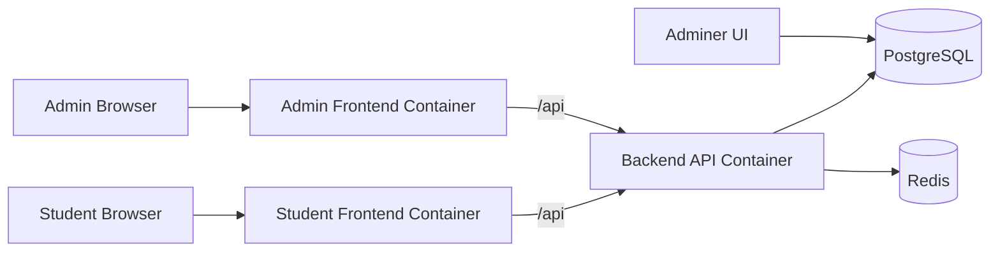

# Coding Platform Architecture

## 1. Purpose And Scope

This document explains the architecture of the coding platform from top to bottom:

1. High-level system view.
2. Container-level responsibilities and runtime interactions.
3. Build and startup behavior.
4. Database bootstrap, migrations, and seed flow.
5. Backend repository module breakdown.
6. End-to-end runtime flows (API, judging, contest updates, admin workflows).

The platform is a containerized, full-stack coding system with:

- Student web app (React + Vite, served by Nginx)
- Admin web app (React + Vite, served by Nginx)
- Go backend API (Gin)
- PostgreSQL database
- Redis cache/session support
- Adminer database UI
- C++ compilation and execution sandbox integrated in backend

---

## 2. System Architecture (High Level)

At the highest level, this is a browser-to-API architecture with the backend as the control plane and PostgreSQL as the source of truth.

### Core architectural characteristics

- Single Docker Compose stack for local/dev deployment.
- Backend is stateless at process level; data lives in PostgreSQL/Redis.
- Frontends are static builds served by Nginx and reverse-proxy API calls to backend.
- Judge execution happens inside backend container using process-level sandbox controls.
- Admin workflows and contest/problem management are first-class in backend routes.

---

## 3. Container Architecture (Level 1)

### 3.1 Services and what they do

1. postgres
- Base image: postgres:15-alpine
- Role: primary relational store for users, problems, contests, submissions, admin metadata, groups, proctoring, and audit logs.
- Persistence: bind mount at ./postgres.
- Initialization: runs config/init.sql only when database directory is empty.

2. redis
- Base image: redis:7-alpine
- Role: fast key/value store used by backend (notably JWT blacklist checks in auth middleware).
- Persistence: bind mount at ./redis.

3. backend
- Built from src/backend/Dockerfile.
- Role: central API and business logic layer.
- Handles auth, RBAC, problems, contests, submissions, grading, groups, proctoring, plagiarism checks, exports, and sandbox execution.
- Security/resource controls in compose:
  - mem_limit and memswap_limit
  - pids_limit
  - cpus
  - capability drop/add
  - no-new-privileges

4. frontend
- Built from src/frontend/Dockerfile.
- Role: student-facing SPA.
- Nginx proxies /api to backend container and serves static SPA files.

5. admin-frontend
- Built from src/admin-frontend/Dockerfile.
- Role: admin-facing SPA for operational workflows.
- Nginx proxies /api to backend container.

6. adminer
- Base image: adminer:4.8.1-standalone
- Role: database administration UI for direct inspection/manual SQL.
- Connects to postgres service inside compose network.

### 3.2 Networking and dependencies

- All services are attached to a shared bridge network: coding-platform-network.
- backend depends on healthy postgres and redis.
- frontends depend on backend.
- adminer depends on healthy postgres.

### 3.3 Port mapping (default local)

- Student frontend: 8080
- Admin frontend: 8081
- Backend API: 3000
- PostgreSQL: 5433 (host) -> 5432 (container)
- Redis: 6380 (host) -> 6379 (container)
- Adminer: 8082

---

## 4. Build And Run Lifecycle (Level 2)

### 4.1 Source setup

scripts/setup.sh supports split-repo bootstrap behavior for backend/frontend cloning when needed.

### 4.2 Image build

scripts/build.sh executes docker compose build for all services.

Build specifics:

- backend Dockerfile is multi-stage:
  - Stage 1: go build static server binary from cmd/server.
  - Stage 2: minimal Alpine runtime with g++, util-linux, and testlib.h for judge components.
  - Creates sandbox user uid 1001 for untrusted execution path.

- frontend/admin-frontend Dockerfiles are multi-stage:
  - Stage 1: npm install + npm run build.
  - Stage 2: nginx serving dist assets with custom nginx.conf.

### 4.3 Container startup

scripts/run.sh does this sequence:

1. Sets explicit host ports.
2. Tries to normalize permissions on postgres and redis bind mounts.
3. Stops existing compose stack.
4. Starts services with rebuild: docker compose up -d --build.
5. Performs simple health/connectivity checks.

Operational implication: each run is deterministic for local stack wiring, while preserving persisted DB/Redis data unless manually removed.

---

## 5. Database Bootstrap, Migrations, And Seed Flow (Level 2)

### 5.1 Bootstrap behavior on first DB creation

PostgreSQL container mounts config/init.sql into docker-entrypoint-initdb.d.

Important rule:

- init.sql runs only when the postgres data directory is empty.
- With existing ./postgres data, init.sql does not rerun.

### 5.2 What init.sql defines

init.sql creates the app schema and major domains:

- Users and auth core
- Problems and tags
- Test cases and generator batches
- Submissions and contest solving tables
- Contests and participants
- Admin authoring assets:
  - revisions
  - validators
  - checkers
  - generators
  - interactors
  - solutions
- Access control tables:
  - problem_access
  - group membership and join requests
- Auditing and proctoring:
  - admin_audit_log
  - proctor_events

It also creates supporting indexes and inserts default tag seed values.

### 5.3 Incremental migrations for existing DBs

scripts/migrate.sh behavior:

1. Requires running postgres container.
2. Scans config/migrations/*.sql in filename order.
3. Applies each migration via psql with ON_ERROR_STOP.
4. Expects idempotent migration scripts.

Current workspace note:

- config/migrations directory is not present right now, so migrate.sh will no-op.

### 5.4 Demo data seeding

scripts/seed.sh performs controlled reseeding:

- Verifies API health first.
- Truncates and resets many contest/problem/submission/admin tables.
- Preserves identity of user/group-level auth context where intended.
- Registers or logs in demo users.
- Elevates admin role directly in DB.
- Creates and wires problems, tags, components, contests, and group data.

This script is designed for reproducible demo/local datasets.

---

## 6. Backend Repository Architecture (High-Level)

Backend repo structure:

- cmd/server: process entrypoint
- internal/config: environment configuration loading
- internal/database: postgres and redis connectors
- internal/router: HTTP route graph and middleware wiring
- internal/middleware: JWT auth and authorization guardrails
- internal/handlers: business logic endpoints
- internal/models: API/domain structs
- internal/sandbox: compile/execute/judge engine with limits

Conceptually, request flow is:

Router -> Middleware -> Handler -> DB/Redis/Sandbox -> JSON response

---

## 7. Backend Modules (Progressive Deep Dive)

## 7.1 Entry, config, and infrastructure wiring

### cmd/server/main.go

Responsibilities:

- Load config from environment defaults.
- Connect to postgres and redis.
- Build Gin router with dependencies.
- Start HTTP server.

Notable behavior:

- If DB or Redis connection fails, backend logs warning and still boots.
- Health endpoint reflects downstream connection state.

### internal/config

Responsibilities:

- Centralized environment variable loading.
- Supplies defaults for local/docker usage.

Primary domains:

- Server port
- Postgres connection parameters
- Redis connection parameters
- JWT secret and expiry
- Frontend URL

### internal/database

Responsibilities:

- Postgres pool creation/tuning (pgxpool).
- Redis client creation/tuning.
- Initial connectivity verification by ping.

## 7.2 HTTP routing and middleware

### internal/router

Responsibilities:

- Defines complete API route tree under /api.
- Attaches global CORS middleware.
- Creates auth middleware variants:
  - AuthRequired
  - AuthOptional
- Wires admin and domain-specific route groups.

Route domains:

- auth
- questions and tags
- contests
- submissions
- groups
- sandbox
- admin (dashboard, problems, components, tests, contests, users, audit, export, plagiarism)

### internal/middleware/auth.go

Responsibilities:

- JWT token generation and validation.
- Request authentication guard.
- Optional-auth parsing path for mixed public/private endpoints.
- Redis blacklist check for revoked tokens.

### internal/middleware/admin_auth.go

Responsibilities:

- Site-level role hierarchy checks.
- Admin-site access controls including group-admin eligibility.
- Problem-level RBAC checks using problem_access table.

## 7.3 Handler layer (business modules)

Each handler file is effectively a business module.

### handler.go

- Shared Handler dependency object (DB, Redis, Config).
- Health endpoint and connection status checks.

### auth.go

- Registration, login, logout, current-user APIs.
- JWT issuance and blacklist-aware session behavior.

### questions.go

- Problem listing and detail retrieval.
- Problem creation and tagging workflows.
- Sample test execution endpoint.

### submissions.go

- Submission creation and retrieval.
- User submission history endpoints.
- Per-question submission listing for user scope.

### contests.go

- Contest listing/detail and contest-problem retrieval.
- Contest submissions and sample runs in contest context.
- Leaderboard and rating prediction/stream features.
- Contest finalization and user contest history.

### groups.go

- Group discovery and membership management.
- Join request lifecycle for members.
- Admin operations for groups and member roles.

### proctor.go

- Contest proctor event ingestion.
- Admin retrieval and summary of proctor data.

### sandbox.go

- Direct sandbox run endpoint and sandbox health.
- Utility path for immediate code execution testing.

### export.go

- Contest CSV export endpoint for admin workflows.

### admin_dashboard.go

- Aggregated admin dashboard metrics endpoint.

### admin_problems.go

- Full admin CRUD for problems.
- Revision management and publish/unpublish control.
- Per-problem access grant/revoke and audit logging.

### admin_components.go

- Component lifecycle for authoring tools:
  - generators
  - validators
  - checkers
  - interactors
  - solutions
- Includes compile and activation operations.

### admin_tests.go

- Test case CRUD, bulk operations, reorder.
- Generator-driven test creation and validation flow.
- Run reference solution on specific tests.

### admin_testing.go

- Test solution and stress-test orchestration for setters/testers.

### admin_contests.go

- Admin contest CRUD and publication.
- Contest-problem mapping management.
- Admin finalization path.

### admin_submissions.go

- Admin submission browsing.
- Manual grading and rerun operations.

### admin_users.go

- User management and role updates.
- Admin audit-log query endpoint.

### admin_permissions.go

- Shared permission logic for contest/group management checks.

### admin_plagiarism.go

- Manual contest-scoped plagiarism check.
- Uses normalized token features + simhash similarity thresholding.
- Produces suspicious pairs and per-problem clusters.

## 7.4 Domain models

internal/models defines transport/domain structs for:

- user
- problem
- contest
- submission
- group and join requests
- tag
- testcase
- proctor event

These structs reflect API payloads and query scan targets.

## 7.5 Sandbox and judging engine (deep level)

### internal/sandbox/executor.go

Responsibilities:

- Compile C++ code.
- Execute binaries with stdin/argv variants.
- Capture stdout/stderr with output caps.
- Classify statuses (success, TLE, MLE, runtime errors).

### internal/sandbox/judge.go

Responsibilities:

- Compile solution once.
- Compile checker once (default checker if missing).
- Run all test cases.
- Aggregate per-test and overall verdict metrics.

### internal/sandbox/limits.go

Responsibilities:

- Defense-in-depth process controls:
  - rlimits via prlimit
  - ulimit fallback path
  - wall-clock context deadlines
  - process-group kill semantics
  - uid drop to sandbox user when possible
  - process-wide concurrency semaphore via SANDBOX_SLOTS

This package is the critical safety boundary for untrusted code execution.

---

## 8. End-To-End Functional Flow

## 8.1 Platform startup flow

1. docker compose creates network and starts infra containers.
2. postgres and redis become healthy.
3. backend starts, reads env, attempts DB/Redis connections, serves API.
4. frontends start Nginx, serve static app, proxy /api to backend container.
5. adminer starts for DB UI access.

## 8.2 Request handling flow

1. Browser calls frontend origin.
2. Nginx frontend proxies /api request to backend service.
3. Router dispatches route.
4. Middleware resolves auth context and role/access checks.
5. Handler executes business logic.
6. Handler reads/writes postgres and optionally redis.
7. JSON response returned to frontend.

## 8.3 Submission judging flow

1. User sends submission to backend.
2. Backend resolves problem/test/checker config from DB.
3. Sandbox judge compiles submission and checker.
4. Runs tests under resource limits.
5. Produces verdict + metrics.
6. Persists submission results and contest solve/score effects.
7. Returns verdict payload.

## 8.4 Admin authoring and validation flow

1. Admin creates/updates problem.
2. Admin uploads or edits generators/validators/checkers/solutions.
3. Admin compiles and activates selected components.
4. Admin generates and validates tests.
5. Admin publishes problem for student visibility.

## 8.5 Contest execution and post-processing

1. Contest configured with problems and scoring settings.
2. Participants submit during active window.
3. Backend updates participant metrics and standings.
4. Finalization computes final outcomes and rating effects (if rated).
5. Admin can export CSV and review proctor logs.

---

## 9. Operational Notes

- Postgres and Redis are bind-mounted, so data survives container restarts.
- Re-running init.sql alone does not alter existing databases.
- Use migrations for existing environments; use DB reset only when intentional.
- Adminer bypasses app-level audit/validation safeguards, so it is best used for diagnostics and controlled maintenance.
- Backend container-level limits and sandbox-level limits are complementary layers, not substitutes.

---

## 10. Quick Summary

The platform architecture is centered around a Go API backend coordinating all business logic, persistence, and sandboxed execution. Docker Compose provides a clean local deployment boundary, while SQL bootstrap + migration scripts define lifecycle control for database evolution. The backend is organized by clear module boundaries (infra wiring, middleware, handlers, models, sandbox), and each module maps directly to a business capability in the system.